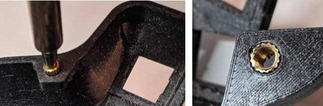
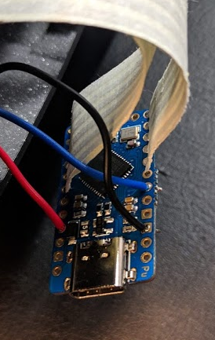

## How to use this guide

The DIY kit is currently in beta. This guide is meant to help you go
through a build. You can click on the pictures to look at a full-res
version of them

## Kit contents

Before beginning, please check that your kit has all the elements you will need. Should something be missing, please contact us immediately. 

Use the kit paper you got with your order.

## Required tools and material

You will need to buy yourself :

- 1 Usb-C cable
- 1 Standard audio cable

To build this keyboard, you will need:

- Soldering iron
- M4 torx or flathead screwdriver
- Soldering tin
- (Optional) Wire stripper
- (Optional) Hot glue gun
- (Optional) Heat gun

## Screw inserts

There are 12 screw inserts to install, 6 on each side of the keyboard

- Set your soldering iron temperature to 200 degrees 
- Using the soldering iron, place the heated insert inside the hole
- *Apply little to no pressure, let the gravity do the work*. Otherwise, you might push them too far
- If the insert doesn't fall into place, you can slowly increase the temperature, but don't go over 300 degrees
- Once the insert is 2/3 of the way in, stop 
- Flip over the case and push it against a flat surface, to make the insert flush with the case

## Diodes

**Pay attention to the orientation of the PCBs: you need two "right", and two "left"**

- Solder all the diodes on the four PCBs (flexyls and thumb clusters)
- Check the orientation of the diodes: use the indications on the PCB

## Ribbon cables

**When installing the ribbon cables, make sure the cables are coming out of the top part of the MCU - with the components, check the picture below**

Cut the ribbon cables using scissors or a cutter:

- 4 * ribbons of 6 cables
- 2 * ribbons of 5 cables

Solder the ribbon cables, for each side:

- Solder a 6-cable ribbon cable on the thumb cluster PCB
- Solder the other end on the flexyl PCB, at the bottom - **make sure the legends align !** C5 should be connected to C5, C6 to C6, and so on

Install the Thumb cluster:

- Solder the 5-cable ribbon cable to the top part of the top connector of the Flexyl (C3 ... R2)
- Solder the other end to the right part of the MCU. **Use the table under** to double-check the correct orientation
- **Make sure the cable is coming out of the top part of the MCU** (with the components). Look at the picture to double-check

| MCU  | Flexyl PCB |
| ------------- | ------------- |
| C6 | C3  |
| D7  | R1  |
| E6  |  C2 |
| B4  | C1  |
| B5  | R2  |

Install the Flexyl:

- Solder a 6-cable ribbon cable to the bottom part of the top connector of the Flexyl (R4 ... R5)
- Solder the other end to the left part of the MCU. **Use the table under** to double-check the correct orientation
- **Make sure the cable is coming out of the top part of the MCU** (with the components). Look at the picture to double-check

| MCU  | Flexyl PCB |
| ------------- | ------------- |
| F5 | R4  |
| F7  | R3  |
| B1  |  C4 |
| B3  | C5  |
| B2  | C6  |
| B6  | R5  |

## Install the switches

**Carefully install the switches in the specified order, using the pictures for help**

- Insert the assembled PCBs into the case
- At all times, make sure it doesn't get stuck outside of the case, make sure it's under the screw inserts
- Starting with the top row, install the two switches in the middle columns and solder them
- Then, install the two switches around it. You will have to push the PCB so it aligns, and then insert the switches. This is by design, and once the switches inserted the PCB won't move. Solder these switches
- Finish the top row
- Do the bottom row in the same way. The PCB won't hold on the switches, you can hold it with the soldering iron and then add the tin
- Finish the top part of the keyboard
- Install the switches on the thumb cluster

## Install the audio jack

- Solder cables to audio jack. Their position is not important, as long as it's the same on both sides. **Do not solder to the MCU yet.**
- Install the heat shrink wrap and shrink it with a heat gun or a lighter
- Screw audio jack into case
- (Optional) add a bit of hot glue to the jack so it holds better. **Only do so in the indicated position**, so it won't interfere with installation of the MCU
- Solder cables to the MCU (Blinky or Elite-C): black to GND, red to Vcc, blue to D0

## Install the MCU Adapter

- Using a 20mm screw and nut, secure the MCU adapter and holder to the mid-plate and bottom plate 
- Slide in the MCU in the adapter until you hit the end. **The MCU is supposed to be a bit outside of the adapter**, don't push too hard
- Slide the holder and install the other screw and nut
- **Do not overtighten**. Screw in until it feels secure

<<TODO PICS>>

## Install the plates

- Carefully slide the USB-C into the hole
- Making sure the USB-C is aligned, install the 6 screws
- **Do not overtighten**. Screw in until it feels secure
