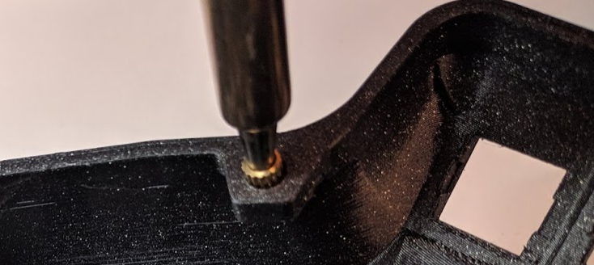
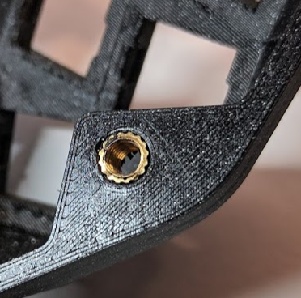

## Step 0 – how to use this guide

The DIY kit is currently in beta. This guide is meant to help you go
through a build. You can click on the pictures to look at a full-res
version of them

## Step 1 – Kit contents

Before beginning, please check that your kit has all the elements you will need. Should something be missing, please contact us immediately. 

Use the kit paper you got with your order.

## Step 2 – Required tools and material


You will need to buy yourself :

- 1 Usb-C cable
- 1 Standard audio cable

To build this keyboard, you will need:

- Soldering iron
- M4 torx or flathead screwdriver
- Soldering tin
- (Optional) Wire stripper
- (Optional) Hot glue gun
- (Optional) Heat gun

## Step 3 - Install screw inserts

- Set your soldering iron temperature to 300 degrees if you can.
- Using the soldering iron, place the heated insert inside the hole
- *Apply little to no pressure, let the gravity do the work*
- Once the insert is 2/3 of the way in, stop 
- Flip over the case and push it against a flat surface, to make the insert flush with the case






## Welcome to GitHub Pages

You can use the [editor on GitHub](https://github.com/HID-Technologies/Bastyl-DIY-cinstructions/edit/gh-pages/index.md) to maintain and preview the content for your website in Markdown files.

Whenever you commit to this repository, GitHub Pages will run [Jekyll](https://jekyllrb.com/) to rebuild the pages in your site, from the content in your Markdown files.

### Markdown

Markdown is a lightweight and easy-to-use syntax for styling your writing. It includes conventions for

```markdown
Syntax highlighted code block

# Header 1
## Header 2
### Header 3

- Bulleted
- List

1. Numbered
2. List

**Bold** and _Italic_ and `Code` text

[Link](url) and 
```

For more details see [GitHub Flavored Markdown](https://guides.github.com/features/mastering-markdown/).

### Jekyll Themes

Your Pages site will use the layout and styles from the Jekyll theme you have selected in your [repository settings](https://github.com/HID-Technologies/Bastyl-DIY-cinstructions/settings). The name of this theme is saved in the Jekyll `_config.yml` configuration file.

### Support or Contact

Having trouble with Pages? Check out our [documentation](https://docs.github.com/categories/github-pages-basics/) or [contact support](https://github.com/contact) and we’ll help you sort it out.
